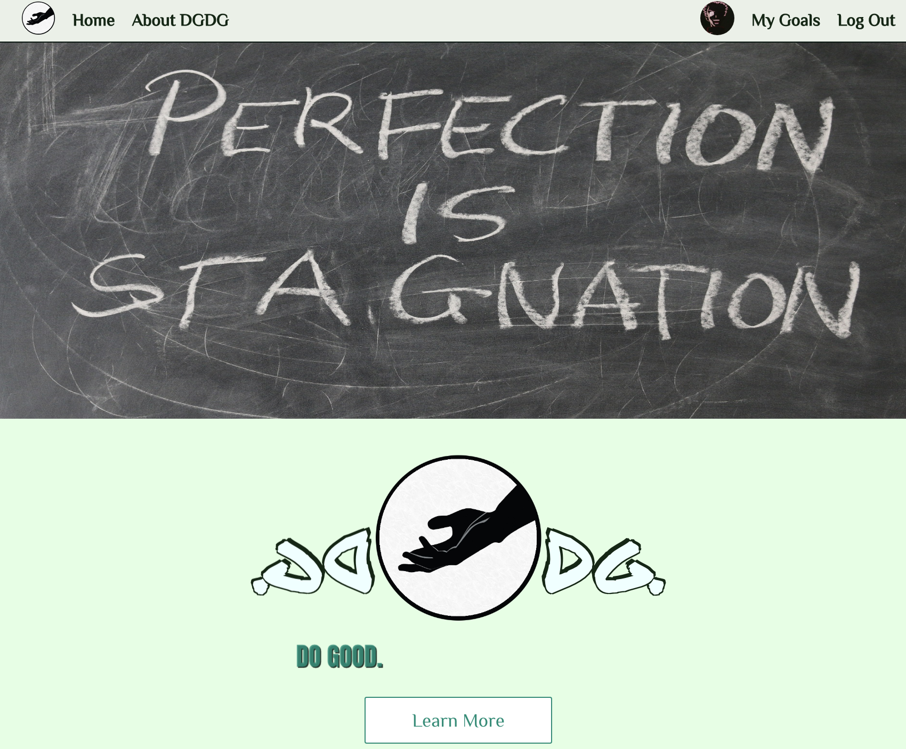

---?image=template/img/bg/gray.jpg&position=bottom&size=100% 15%

@title[Problem One]

@snap[south text-white span-100 footer]
@fa[fab fa-github-square margin-sides]
@size[.4em](marberrym)
@fa[fab fa-linkedin margin-sides]
@size[.4em](Matthew Marberry)
@fa[envelope-o margin-sides]
@size[.4em](marberrym@gmail.com)
@fa[globe margin-sides]
@size[.4em](matthew-marberry.com)
@snapend

@css[headline](The Problem) 
  
A responsive navigation bar without using CSS media queries.

@snap[south-west span-50]
@css[navImg]()
@snapend

@snap[south-east span-50]
@css[navImg]()
@snapend

