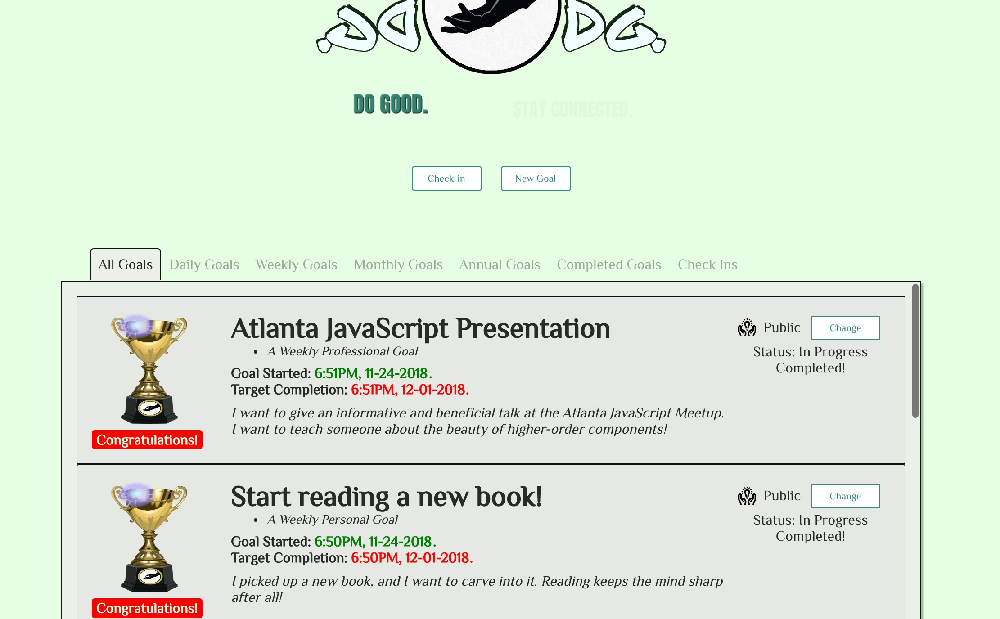

---?image=template/img/bg/gray.jpg&position=bottom&size=100% 15%

@title[Problem Two]

@snap[south text-white span-100 footer]
@fa[fab fa-github-square margin-sides]
@size[.4em](marberrym)
@fa[fab fa-linkedin margin-sides]
@size[.4em](Matthew Marberry)
@fa[envelope-o margin-sides]
@size[.4em](marberrym@gmail.com)
@fa[globe margin-sides]
@size[.4em](matthew-marberry.com)
@snapend

@css[headline](@css[text-blue](The Problem))
  
A reusable function for handling API requests for information once a component is mounted.
 

---?image=template/img/bg/gray.jpg&position=bottom&size=100% 15%

@title[Problem Two]

@snap[south text-white span-100 footer]
@fa[fab fa-github-square margin-sides]
@size[.4em](marberrym)
@fa[fab fa-linkedin margin-sides]
@size[.4em](Matthew Marberry)
@fa[envelope-o margin-sides]
@size[.4em](marberrym@gmail.com)
@fa[globe margin-sides]
@size[.4em](matthew-marberry.com)
@snapend

@snap[north span-100]
@css[headline text-blue](Requirements)
@ol
- @size[.6em](Can be used for **any @css[text-blue](api endpoint)** with **any type of @css[text-blue](HTTP request).**)
- @size[.6em](Can store the @css[text-blue](**response data**) in state.)
- @size[.6em](Passes down whether or not my request is currently @css[text-blue](**loading**).)
@olend
<iframe src="https://giphy.com/embed/udhngZK2IFTc4" width="480" height="327" frameBorder="0" class="giphy-embed" allowFullScreen></iframe>

@snapend

